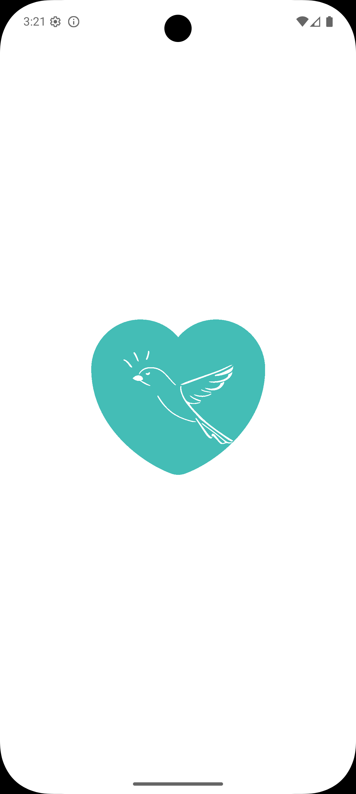
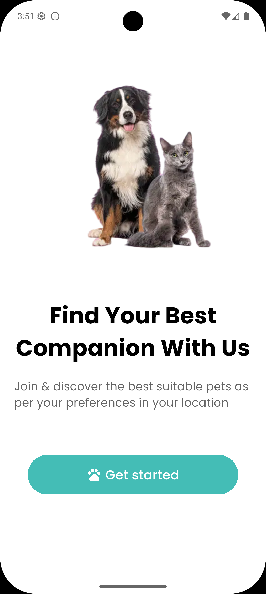
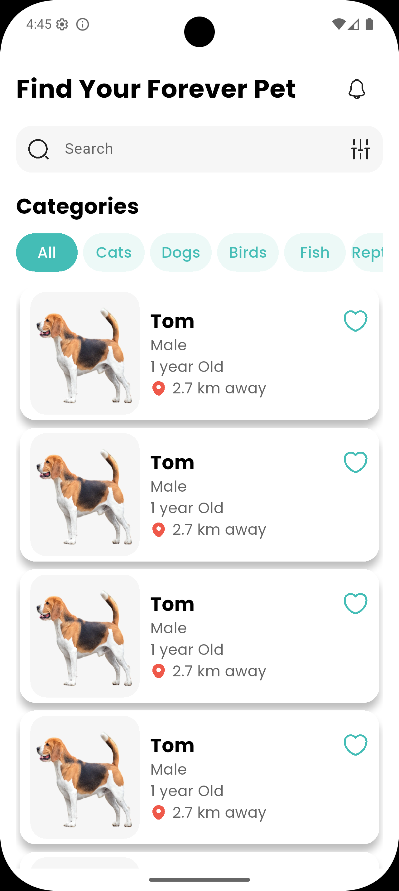
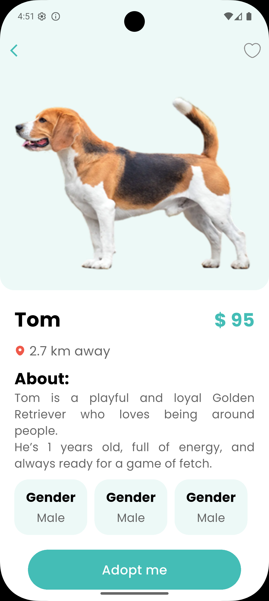
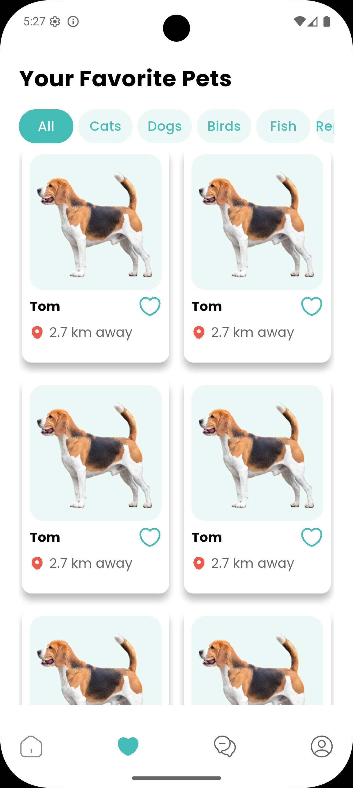
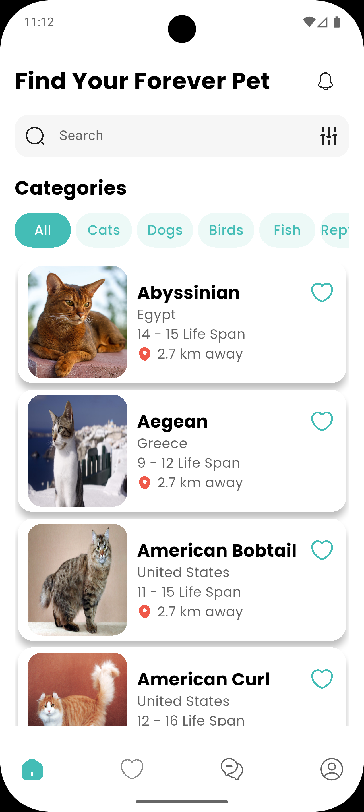
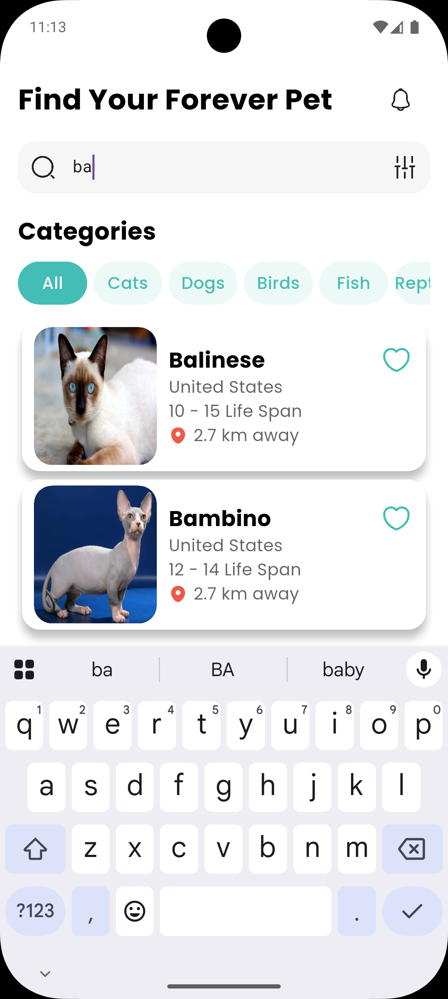
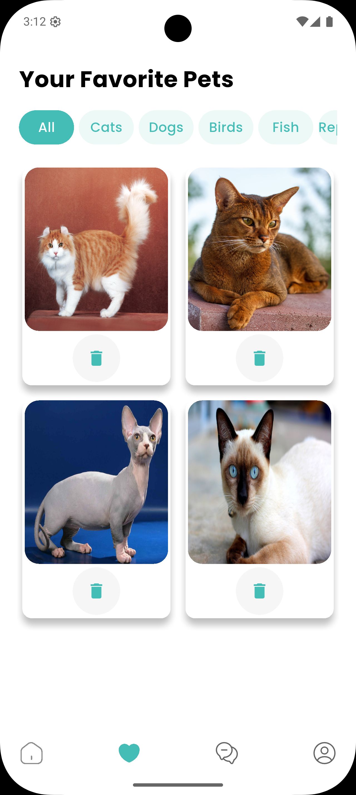
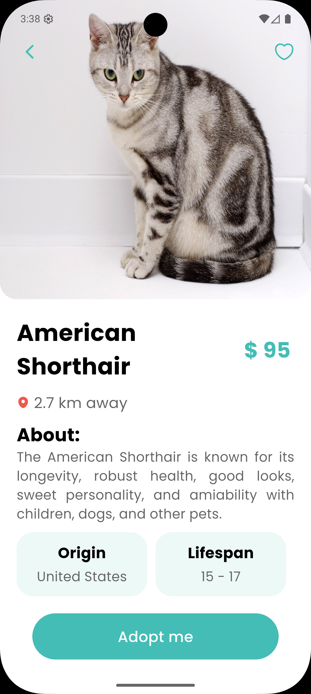

## Tests Explanation

In this project, I created unit, widget, and integration tests to ensure the app works correctly:

Home Repository Tests

Test HomeRepoImpl to fetch pet data.

Check if it returns a list of pets on success and ServerFailure on errors.

Favourites Repository Tests

Test FavouriteRepoImpl to manage favorite pets.

Covers getting, adding, and deleting favorites.

Ensures proper error handling with server failures.

Widget Tests

Test PetItem widget to display pet name, origin, and life span correctly.

Integration Tests

Test full app flow: Splash → OnBoarding → Main Home → Favorites.
Check navigation and major UI elements like CustomNavBar and GNav

